# Android Personal Finance Automation

## 🏦 Overview

An automation that **records and categorizes my bank transactions**. It handles the entire process of data capture using Macrodroid to Google Sheets, cleaning and transformation with R, data analysis with PostgreSQL, and a dashboard with Looker Studio to visualize my finances based on my budget.

Developed as a personal project and as practice.

---

## 💡 Project context

I’ve always struggled to keep a consistent record of my personal finances. I’ve bought personal finance apps and subscriptions that let you upload Excel files, speak to them via voice notes, have their own widget to make recording transactions easier, and are integrated with Siri or Google—and I still can’t keep track. 

So I decided to **build my own solution**, and I used the project as an opportunity to apply tools I wanted to master: PostgreSQL to structure and query the data, Looker Studio to visualize it, and Git to version control the entire process. My only involvement is to check occasionally that the categorizations made by Gemini are correct.

## 🏗️ Project Arquitecture

The idea behind this pipeline was to **build something real that would be useful in my day-to-day life.**

1. Capture: I chose MacroDroid because it has a well-designed interface for Android and allowed me to build this workflow seamlessly.
2. Processing: A Google Apps Script orchestrates the core part—it calls the Gemini API, which takes the description and returns the category and subcategory in structured JSON, and then writes the record to Google Sheets. I chose Gemini for its natural integration with the Google ecosystem.
3. Analysis and visualization: The data in Sheets will serve as input for a cleaning and transformation process in R, and then be loaded into PostgreSQL for analysis.
4. The final destination is a dashboard in Looker Studio tracking expenses vs. budget.

```mermaid
flowchart TB
 subgraph SG1["Detection and capture"]
    direction TB
        A["🏦 Lulo Bank
        Transaction occurs"]
        B["📲 Push notification of the transaction"]
  end
 subgraph SG2["Processing and logging"]
    direction TB
        C["⚙️ Macrodroid
        Captures the notification"]
        D["💬 Macrodroid asks
        What was the transaction for?"]
        E["✍️ User replies with a brief description
        e.g. coffee, rent payment"]
        F["🦾 Gemini
        Categorizes the transaction"]
        G["📊 Google Sheets
        Automatic record"]
  end
 subgraph SG3["ETL"]
    direction TB
        H["⚙️ R
        Data cleaning and transformation"]
        I["👩🏻‍💻 PostgreSQL
        Load to database"]
  end
subgraph SG4["Visualization"]
direction TB
      J["🩻 Looker Studio
    Spending vs budget dashboard"]
end
    A --> B
    C --> D
    D --> E
    E --> F
    F --> G
    H --> I
    SG1 --> SG2
    SG2 --> SG3
    SG3 --> SG4
    style A fill:#b3d9ff,stroke:#2979ff,stroke-width:2px,color:#222
style B fill:#cce8ff,stroke:#448aff,stroke-width:2px,color:#222
style SG1 fill:#e8f4ff,stroke:#2979ff,stroke-width:2px,stroke-dasharray: 3 3,color:#222
style C fill:#c7ceff,stroke:#7b68ee,stroke-width:2px,color:#222
style D fill:#d1c4e9,stroke:#9370db,stroke-width:2px,color:#222
style E fill:#e1bee7,stroke:#ba55d3,stroke-width:2px,color:#222
style F fill:#f3c8e8,stroke:#c2185b,stroke-width:2px,color:#222
style G fill:#f8d7ea,stroke:#c2185b,stroke-width:2px,color:#222
style SG2 fill:#f2ecff,stroke:#7b68ee,stroke-width:2px,stroke-dasharray: 3 3,color:#222
style H fill:#b7e4c7,stroke:#2d6a4f,stroke-width:2px,color:#222
style I fill:#c8e6c9,stroke:#43a047,stroke-width:2px,color:#222
style SG3 fill:#edfff4,stroke:#43a047,stroke-width:2px,stroke-dasharray: 3 3,color:#222
style J fill:#ffe0b2,stroke:#e65100,stroke-width:2px,color:#222
style SG4 fill:#fff8e1,stroke:#f9a825,stroke-width:2px,stroke-dasharray: 3 3,color:#222
```



## 📁 Repository Structure

```
personal-finance-automation/
│
├── 1.sheets-pipeline/
│   ├── macrodroid_macro             # Contains the macro structure
│   ├── categorize_transaction.gs    # Calls the Gemini API and writes to Sheets
│   └── categorize_historical.gs     # Processes historical rows in batches using triggers
│
├── 2.DDL/
│   └── create_tables.sql            # Table definitions in PostgreSQL
│
├── 3.ETL/
│   ├── cleaning.R                   # Data cleaning and transformation from Sheets
│   └── load_postgres.R              # Loading data into PostgreSQL
│
└── 4.data-viz/
    └── dashboard_notes.md           # Documentation of the dashboard in Looker Studio
```

---

## 🛠️ Data Model

### Fact Table

* `transactions`

  * Granularity: **bank transaction**
  * Contains:

    * `transaction_id`
    * `date`
    * `amount`
    * `store`
    * `acc_id`
    * `cat_id`
    * `subcat_id`
    * `note`

---

### Dimension Tables

* `dim_categories`
* `dim_subcategories`
* `dim_accounts`
* `dim_budget`

### 📝 Design decisions

- `transactions.cat_id` references `categories.cat_id` and `transactions.subcat_id` references `subcategories.subcat_id` so each transaction has a category and subcategory.
- `transactions.acc_id` references `accounts.acc_id` so each transaction is associated to a bank account.
- `budget_qty` and `qty_amount` are nullable to allow for two modes: 1) defining the budget as `budget_qty` × `qty_amount` = `budget_amount` or 2) entering an amount directly into `budget_amount`
- All monetary values are NUMERIC instead of FLOAT to avoid floating-point precision errors in large aggregations

---

## 📋 How to use it

### Requirements
- PostgreSQL 14+
- Macrodroid
- Google Sheets

### Installation

1. Create a google sheets file and name it however you want.
2. Create a new deployment at AppScript in google sheets.
3. Copy the categorize_transaction.gs file in the extension into the deployment.
4. Download Macrodroid and install this macro.
5. Link the application web url to Macrodroid at the HTTP request in the actions block.
6. Configure the script properties as:
   1. 'ApiKey' = Get an API key obtained at Google AI Studio.
   2. 'url' = The value is the application web url at AppScripts manage deployments.
   3. 'idArchivo' = The value is the deployment ID at AppScripts manage deployments.
   4. 'NumeroTarjeta' = is the last 4 digits of Lulo's credit card shown in the notification when making a transaction.
---

## 🤸🏻 Author

Andrea Chamorro Data Analyst
